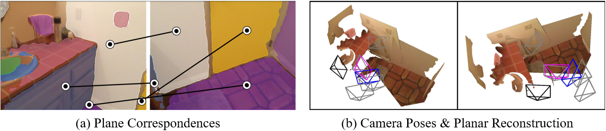

# NOPE-SAC: Neural One-Plane RANSAC for Sparse-View Planar 3D Reconstruction [[arXiv]](https://arxiv.org/abs/2211.16799)
### Bin Tan, Nan Xue, Tianfu Wu, Gui-Song Xia

---


## Highlights
- We present a novel approach, i.e., **NOPE-SAC**, to address the challenging problem 
of **sparse-view planar 3D reconstruction** in a RANSAC framework.
- We show that accurate camera poses can be achieved from only a few 
plane correspondences with the proposed neural **one-plane pose hypotheses**, thus incurring 
any offline optimization procedures.
- Our method sets several new state-of-the-art performances on both 
the Matterport3D and the ScanNet datasets for pose estimation and holistic planar reconstruction.


## Installation
```
conda env create -f environment.yml
conda activate NopeSAC
```

## Data prepare
### Matterport3D dataset
Please download the processed sparse-view data of Matterport3D from [SparsePlanes](https://github.com/jinlinyi/SparsePlanes/blob/main/docs/data.md) 
and unzip them into 'datasets/'. The structure of the data file should be like:
```
/datasets
|-- mp3d_dataset
    |-- mp3d_planercnn_json
        |-- cached_set_test.json
        |-- cached_set_val.json
        |-- cached_set_train.json
    |-- obversions
        |-- ...
    |-- rgb
        |-- ...
```

### ScanNet dataset
- TODO

## Inference and Evaluation
Download the pretrained models from [here](https://drive.google.com/drive/folders/1ruo35BKxX3RR_Iy1KXWuK3OGB07ZHRb-?usp=share_link) and save them into 'models/'. 
Then, you can run the following command to inference with the pretrained model on
the Matterport3D and ScanNet datasets.
```
# inference on mp3d dataset
python test_NopeSAC.py \
--config-file configs/inference_mp3d.yaml \
--num-gpus 4 \
--eval-only \
TEST.EVAL_FULL_SCENE True \
MODEL.CAMERA_HEAD.INFERENCE_OUT_CAM_TYPE "soft" \
DATASETS.ROOT_DIR 'datasets/mp3d_dataset/'

# test NopeSAC on scannet dataset
#CUDA_VISIBLE_DEVICES=3 python test_NopeSAC.py \
#--config-file configs/inference_scannet.yaml \
#--num-gpus 4 \
#--eval-only \
#TEST.EVAL_FULL_SCENE True \
#MODEL.CAMERA_HEAD.INFERENCE_OUT_CAM_TYPE "soft" \
#DATASETS.ROOT_DIR 'datasets/scannet_dataset/'
```
After inference, you can run the following command to evaluate the results. 
Or you can also directly download our inference results from [here](https://drive.google.com/drive/folders/1noUBa9crVPG1H-nb1Bkdma96c_MlNDXj?usp=share_link) 
and save them into 'results/'.
```
# evaluate plane reconstrucction on the Matterport3D dataset
python eval.py \
--config-file configs/inference_mp3d.yaml \
--rcnn-cached-file ./results/mp3d_testSet/NopeSAC_instances_predictions.pth \
--evaluate AP \
--num-process 16 \
--dataset-phase "mp3d_test" \
--optimized-dict-path ./results/mp3d_testSet/continuous.pkl

# evaluate camera pose on the Matterport3D dataset
python eval.py \
--config-file configs/inference_mp3d.yaml \
--rcnn-cached-file ./results/mp3d_testSet/NopeSAC_instances_predictions.pth \
--evaluate camera \
--num-process 16 \
--dataset-phase "mp3d_test" \
--optimized-dict-path ./results/mp3d_testSet/continuous.pkl

# evaluate plane reconstrucction on the ScanNet dataset
python eval.py \
--config-file configs/inference_scannet.yaml \
--rcnn-cached-file ./results/scannet_testSet/NopeSAC_instances_predictions.pth \
--evaluate AP \
--num-process 16 \
--dataset-phase "scannet_test" \
--optimized-dict-path ./results/scannet_testSet/continuous.pkl

# evaluate camera pose on the the ScanNet dataset
python eval.py \
--config-file configs/inference_scannet.yaml \
--rcnn-cached-file ./results/scannet_testSet/NopeSAC_instances_predictions.pth \
--evaluate camera \
--num-process 16 \
--dataset-phase "scannet_test" \
--optimized-dict-path ./results/scannet_testSet/continuous.pkl
```

## Training
You can run the following command to train our NOPE-SAC on the Matterport3D dataset:
```
# train NopeSAC on mp3d dataset (step1)
python train_NopeSAC.py \
--config-file configs/train_mp3d_step1.yaml \
--num-gpus 4 \
--resume \
DATASETS.ROOT_DIR 'datasets/mp3d_dataset/'

# train NopeSAC on mp3d dataset (step2)
python train_NopeSAC.py \
--config-file configs/train_mp3d_step2.yaml \
--num-gpus 4 \
--resume \
DATASETS.ROOT_DIR 'datasets/mp3d_dataset/'

# train NopeSAC on mp3d dataset (step3)
python train_NopeSAC.py \
--config-file configs/train_mp3d_step3.yaml \
--num-gpus 4 \
--resume \
DATASETS.ROOT_DIR 'datasets/mp3d_dataset/'
```
You can run the following command to train our NOPE-SAC on the ScanNet dataset:
```
# train NopeSAC on scannet dataset (step1)
python train_NopeSAC.py \
--config-file configs/train_scannet_step1.yaml \
--num-gpus 4 \
--resume \
DATASETS.ROOT_DIR 'datasets/scannet_dataset/'

# train NopeSAC on scannet dataset (step2)
python train_NopeSAC.py \
--config-file configs/train_scannet_step2.yaml \
--num-gpus 4 \
--resume \
DATASETS.ROOT_DIR 'datasets/scannet_dataset/'
```

## Visualization
- TODO


## Acknowledgement
This repo largely benefits from [SparsePlanes](https://github.com/jinlinyi/SparsePlanes). 
We thank the authors for their great work.